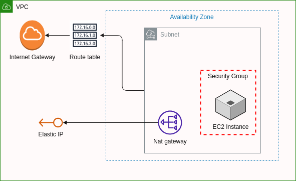

# VPC básica con una instancia Ec2

## Architecture

Esta configuración establece una infraestructura básica con:

- Una VPC
- Una subred pública
- Una instancia EC2 en esa subred
- Utiliza NAT Gateway para permitir que la instancia acceda a Internet.
- El grupo de seguridad permite el acceso SSH y HTTP a la instancia.



- VPC (Virtual Private Cloud):
  - Crea una VPC con la dirección IP especificada en var.vpc_cidr_block.
  - Habilita el soporte para nombres de host DNS y el soporte de DNS.
  - Asigna el nombre "lab-vpc" a la VPC.
- Subred Pública:
  - Crea una subred pública dentro de la VPC, con la dirección IP especificada en var.public_subnet_cidr_block.
  - Asigna la subred a una zona de disponibilidad específica (var.public_subnet_zone).
  - Permite la asignación automática de direcciones IP públicas a instancias lanzadas en esta subred.
  - Asigna el nombre "public-subnet" a la subred.
- Internet Gateway:
  - Crea un Internet Gateway y lo asocia a la VPC.
- Tabla de Rutas:
  - Crea una tabla de rutas para la VPC.
  - Agrega una regla de ruta que envía todo el tráfico (0.0.0.0/0) al Internet Gateway.
- Asociación de Tabla de Rutas:
  - Asocia la tabla de rutas creada con la subred pública.
- Elastic IP y NAT Gateway:
  - Crea una Elastic IP (aws_eip.nat) que se utilizará para el NAT Gateway.
  - Crea un NAT Gateway (aws_nat_gateway.nat) asociado a la Elastic IP y a la subred pública.
- Grupo de Seguridad:
  - Crea un grupo de seguridad (aws_security_group.ec2-sg) que permite el tráfico SSH (puerto 22) y HTTP (puerto 80) entrante, y todo el tráfico saliente.
- Instancia EC2:
  - Crea una instancia EC2 (aws_instance.example) en la subred pública.
  - Utiliza una AMI específica (var.ec2_ami) y un tipo de instancia (var.ec2_instance_type).
  - Asigna un grupo de seguridad a la instancia.
  - Define un script user_data que se ejecuta al inicio para actualizar el sistema, instalar Apache y crear una página web de "Hello world".
  - Asigna el nombre "EC2 instance using Terraform" a la instancia.

## Initialize

```bash
terraform init
```

## Plan

```bash
terraform plan
```

## Apply

```bash
terraform apply -auto-approve
```

## Verify

Obtener la IP desde el output de terraform:

Connect to the instance:

```bash
ssh -i ~/.ssh/Terraform.pem ec2-user@3.249.50.237
```

Result:

```bash
The authenticity of host '3.249.50.237 (3.249.50.237)' can't be established.
ED25519 key fingerprint is SHA256:q5+K3doMNoSwVruJkkfCZV6pxwtM25gl4sm8yx6W900.
This key is not known by any other names
Are you sure you want to continue connecting (yes/no/[fingerprint])? yes
Warning: Permanently added '3.249.50.237' (ED25519) to the list of known hosts.
   ,     #_
   ~\_  ####_        Amazon Linux 1 (AL AMI 2018.03)
  ~~  \_#####\
  ~~     \###|       AL1 has been in Maintenance Support since 2020-12-31.
  ~~       \#/ ___
   ~~       V~' '->  On 2023-12-31, AL1 will reach End of Life.
    ~~~         /
      ~~._.   _/     Newer Amazon Linux versions are:
         _/ _/       - Amazon Linux 2023, supported until 2028-03-15
       _/m/'           https://aws.amazon.com/linux/amazon-linux-2023/
                     - Amazon Linux 2, supported until 2025-06-30
                       https://aws.amazon.com/amazon-linux-2/

Thanks for using https://aws.amazon.com/amazon-linux-ami/
[ec2-user@ip-10-0-2-85 ~]$ 
```

Web server:

- [http://3.249.50.237]


## Destroy

```bash
terraform destroy -auto-approve
```

## References

- [example](https://www.adictosaltrabajo.com/2020/06/19/primeros-pasos-con-terraform-crear-instancia-ec2-en-aws/)
- [Add AWS credentials in Terraform](https://medium.com/@knoldus/add-aws-credentials-in-terraform-b43efa7b934d)
