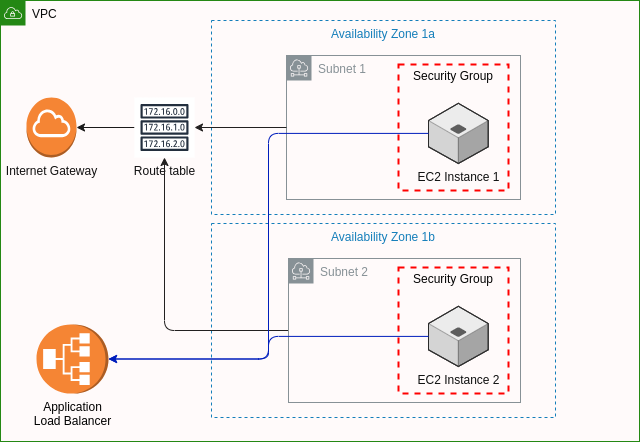
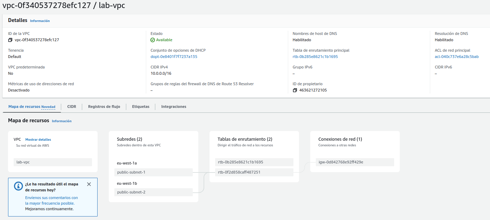

# VPC con dos instancias Ec2 balanceadas por un ALB

## Architecture

Esta configuración establece una infraestructura básica con:

- Una VPC con subredes públicas.
- Una puerta de enlace a Internet para la VPC.
- Un balanceador de carga de aplicaciones (ALB) para distribuir el tráfico.
- Grupos de seguridad para el ALB y las instancias EC2.
- Dos instancias EC2 en subredes diferentes, con un script que instala un servidor web Apache.
- Configuración de rutas y asociaciones para permitir la conectividad y el tráfico a través de Internet.



- VPC (Red Privada Virtual):
  - Se crea una VPC (Virtual Private Cloud) en AWS con un bloque de direcciones IP especificado (var.vpc_cidr_block).
  - La VPC tiene habilitados los nombres de host DNS y el soporte DNS.
  - Se etiqueta la VPC con el nombre "lab-vpc".
- Subredes:
  - Se definen dos subredes públicas dentro de la VPC.
  - Cada subred se asocia a una zona de disponibilidad específica (definida por las variables var.public_subnet_zone_1 y var.public_subnet_zone_2).
  - Las instancias lanzadas en estas subredes tendrán asignadas automáticamente direcciones IP públicas.
  - Cada subred se etiqueta con un nombre.
- Puerta de Enlace a Internet:
  - Se crea una puerta de enlace a Internet y se asocia con la VPC.
- Tabla de Rutas:
  - Se crea una tabla de rutas asociada a la VPC.
  - Se agrega una ruta por defecto que apunta a la Puerta de Enlace a Internet.
  - Asociaciones de Tabla de Rutas:
    - Se asocia cada subred pública con la tabla de rutas.
- Balanceador de Carga (ALB):
  - Se crea un Balanceador de Carga de Aplicaciones (ALB) con un nombre específico, tipo de carga, grupo de seguridad y subredes asociadas.
- Grupos de Seguridad:
  - Se crean dos grupos de seguridad: uno para el ALB y otro para las instancias EC2.
  - El grupo de seguridad del ALB permite el tráfico entrante en el puerto 80 (HTTP).
  - El grupo de seguridad de las instancias EC2 permite el tráfico entrante en los puertos 22 (SSH) y 80 (HTTP), y todo el tráfico saliente.
- Escucha del Balanceador de Carga:
  - Se configura una escucha en el ALB en el puerto 80, redirigiendo el tráfico a un grupo de destinos.
- Grupo de Destinos:
  - Se crea un grupo de destinos para el ALB, especificando el protocolo (HTTP) y el puerto (80).
  - Adjuntos al Grupo de Destinos:
    - Se asocia cada instancia EC2 con el grupo de destinos.
- Instancias EC2:
  - Se definen dos instancias EC2, cada una en una subred pública diferente.
  - Estas instancias utilizan una AMI específica, un tipo de instancia determinado, una subred asignada, un grupo de seguridad, una clave SSH y un script de usuario para instalar y configurar un servidor web Apache.

**Vpc:**



## Initialize

```bash
terraform init
```

## Plan

```bash
terraform plan
```

## Apply

```bash
terraform apply -auto-approve
```

Output:

```bash
instance1-ip = "176.34.248.72"
instance2-ip = "34.244.130.200"
lb_dns_name = "example-lb-1084520162.eu-west-1.elb.amazonaws.com"
```

## Verify

Http instance 1:

- [http://176.34.248.72]


Http instance 2:

- [http://34.244.130.200]


Load balancer:

- [http://example-lb-1084520162.eu-west-1.elb.amazonaws.com]


## Destroy

```bash
terraform destroy -auto-approve
```
